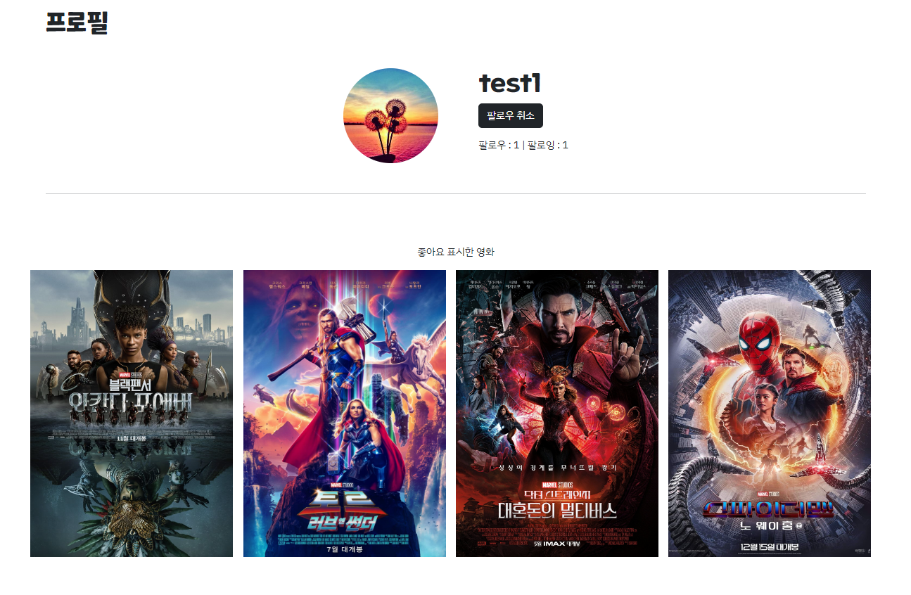

# 8기 FINAL 관통 PJT : 영화 추천 알고리즘 기반 커뮤니티 서비스

## 목차

1. [공통 요구 사항](#공통-요구-사항)
2. [필수 요구 사항](#필수-요구-사항)
3. [팀원 정보 및 업무 분담 내역](#팀원-정보-및-업무-분담-내역)
4. [기능 구현 페이지](#기능-구현-페이지)
5. [추천 알고리즘](#추천-알고리즘)
6. [후기](#후기)

---

## 공통 요구 사항

## 개발 환경

- Python :                 '3.9.13'
- Django :                 '3.2.13'
- node.js :               '16.18.0'
- Django REST Framework:   '3.14.0'
- Vue 2

---

## 필수 요구 사항

### 개요

- 필수 요구사항은 프로젝트 내에 반드시 포함되어야 합니다.
- 이외의 추가적인 기능 및 반응형 디자인 등은 팀 별로 자유롭게 수행할 수 있습니다.
  - 영화 데이터
  - 영화 추천 알고리즘
  - API
  - 커뮤니티
  - README
  - 기타

### 영화 데이터

- 본 프로젝트는 영화 를 주제로 진행되기 때문에, 영화 정보 데이터를 필수적으로 가지고 있어야 합니다.
- 최소 50 개 이상 존재해야 합니다.
- 데이터는 fixtures 를 사용하여 언제든 load 될 수 있도록 준비합니다.\

### 영화 추천 알고리즘

- 추천 방식은 자유롭게 구성하되 해당 서비스를 이용하는 사용자는 반드시 최소 1 개 이상의 영화를 추천 받을 수 있어야 합니다.
- 어떠한 방식으로 추천 시스템을 구현 했는지 기술적으로 설명할 수 있어야 합니다.

### API

- 사용하는 API 에는 제한이 없습니다.
- 다만 유료 API 서비스는 주의가 필요합니다.

### 커뮤니티

- 유저간 소통 할 수 있는 커뮤니티 기능을 구현해야 합니다. (게시글 댓글 좋아요 팔로우 등)
- 소통 방식은 자유롭게 구성합니다.

### README

- 반드시 아래의 내용이 작성되어 있어야 합니다.
  - 팀원 정보 및 업무 분담 내역
  - 목표 서비스 구현 및 실제 구현 정도
  - 데이터베이스 모델링 (ERD)
  - 영화 추천 알고리즘에 대한 기술적 설명
  - 서비스 대표 기능에 대한 설명 
  - 배포 서버 URL ( 배포했을 경우)
  - 기타 느낀 점 후기 등

### 기타

- 최소한 5 개 이상의 URL 및 페이지를 구성해야 합니다.
- HTTP Method와 HTTP response status code 는 상황에 맞게 적절하게 반환되어야 하며, 필요에 따라 적절한 에러 페이지를 구성해야 합니다.
- .gitignore 파일을 사용하여 불필요한 파일 및 폴더는 제출하지 않도록 합니다.
- 프로젝트명
  - final pjt front, final pjt back 두 서버를 모두 사용하는 경우

### 선택 요구사항

- 배포는 선택적으로 진행합니다.
- 배포 진행은 공용 노션의 해당 문서를 참고합니다.
  1. 서버(Django) 배포
  2. 클라이언트 (Vue) 배포

## 팀원 정보 및 업무 분담 내역

### 강동훈

- 기획, Back-end, 디자인

### 김민수

- 기획, Front-end, 디자인

### ERD

### 컴포넌트 구조

## 기능 구현 페이지

### 1.MovieView

- 메인화면이며 TMDB를 통해 인기순으로 영화목록을 보여줍니다.

- 마우스 포인터를 영화포스터에 올리면 영화의 제목과 평점을 나타냅니다.

- 영화 목록은 무한스크롤을 통해 30개씩 보여줍니다.

---

### 2. DetailView

- 영화의 전반적인 정보들과 예고편을 볼 수 있습니다.
- 영화마다 댓글을 작성할 수 있게 했습니다.
- 댓글 수정 및 삭제는 작성자만 가능하게 구현했습니다.
- 좋아요 기능도 구현했습니다.

---

### 3.SingUpView

- ID와 비밀번호를 가지고 회원가입을 할 수 있습니다.

- 추가로 프로필 사진을 넣을 수 있습니다.

- 회원가입 에러 사항을 아래에 표시되게 했습니다.
  
  

---

### 4. LoginView

- 사이드바에 로그인페이지를 구현하여 어느 페이지에서든 로그인이 가능합니다.
  
  

---

### 5. RecommendView

- 좋아요 표시한 영화 중에서 가장 많은 장르 1순위, 2순위를 가지고 영화를 5개 추천합니다.
  
  그리고 같은 배우가 나온 다른 영화 3개를 추천합니다.

- 8개 추천이후 추천한 영화는 추천한 영화 리스트에 저장하여 다른 영화가 추천되게 구현했습니다.

- 만약 좋아요한 영화 리스트가 없으면 TMDB의 인기영화를 추천합니다.

---

### 6. CommunityView

- 최신글이 상단에 가도록 구현했습니다.
- 페이지네이션을 이용하여 게시글을 볼 수 있습니다.
- 게시글 작성 및 수정이 가능합니다

---

### 7. ProfileView

- 회원정보 수정 기능을 구현했습니다.
- 사용자가 좋아요한 영화 목록을 볼 수 있습니다.
- 다른 사용자의 프로필에 들어가면 팔로우를 할 수 있습니다.

---

### 추천 알고리즘

1. 유저가 좋아요 누른 영화의 목록을 DB에서 가져옵니다.
   i. 만약 좋아요 누른 영화가 없다면, DB에서 인기도 순서대로 정렬시켜서 차례대로 8개씩 묶어서 요청할 때마다 프론트 서버에 제공합니다.
2. 이미 추천한 목록에 포함되어 있는 영화는 모두 제거하기 위해서 미리 받아서 저장해둡니다.
3. 장르 딕셔너리를 만들고, 좋아요 누른 영화의 장르를 DB에서 받아와서 장르가 나올때마다 그 장르의 카운트를 하나씩 올립니다.
4. 배우 딕셔너리를 만들고, 좋아요 누른 영화의 주연 배우를 DB에서 받아와서 배우 이름마다 카운트를 하나씩 올립니다.
5. 좋아요 누른 영화 또한 추천할 필요 없으므로 이미 추천한 목록에 추가합니다. 
6. 장르 딕셔너리를 카운트에 대해서 오름차순으로 정렬하고, 가장 많은 카운트를 가진 장르부터 차례대로 3개씩 묶어서 장르조합을 만듭니다.
   i. 만든 장르 조합을 이용해서 DB에서 모두 일치하는 장르를 가진 영화를 추출합니다. (보통 영화는 주로 3-4개의 장르를 가집니다.)
   ii. 추출한 영화를 인기순으로 정렬해서 추천목록에 저장합니다. 이때 이미 추천한 목록에 있는 영화는 제외합니다.
   iii. 만약, 이 장르 조합을 통해서 5개의 추천 영화를 추출하지 못했다면, 다음 장르 조합을 이용해서 i.부터 반복합니다.
7. 배우 딕셔너리를 카운트에 대해서 오름차순으로 정렬하고, 가장 많은 카운트를 가진 배우부터 차례대로 가져옵니다.
   i. 가져온 배우의 ID를 이용해서 TMDB API에서 그 배우가 출연한 출현영화를 받아와서 인기순으로 정렬합니다.
   ii. 가장 인기 많은 영화를 추출하고, 만약 그 영화가 현재 DB에 존재하지 않는다면 DB에 저장합니다.
   iii. 추출한 영화를 추천목록에 저장하고, 이때 이미 추천한 목록에 있는 영화는 제외합니다.
   iv. 만약, 이 배우가 출연한 영화목록을 모두 사용했다면, 다음으로 인기많은 배우를 가져와서 i.부터 반복합니다. 
8. 완성된 추천목록에 들어있는 영화를 프론트 서버에 제공합니다. 
9. 만약 추천목록을 제공한 추천목록을 모두 소진했다면, 이미 추천한 목록을 요청에 추가해서 백 서버에 요청합니다. 
10. 1부터 반복합니다.

---

### 후기

이번 프로젝트를 통해 많은 것을 배웠습니다.

기획단계에서 구현해야할 기능들을 정의하고 기간을 정하고 역활 분담을 했습니다. 다만, 개발 단계에서 기획에서 생각했던 것 보다 더 많은 기능들이 필요로 했고, 예상치 못한 오류로 많은 시간을 사용했습니다

그래서 기능마다 시간배분을 좀더 해서 모든 기능을 구현했습니다. 그리고 오류를 해결해나가며 기존에 배웠던 내용을 숙달해가며 새로운 내용을 배웠고 빠른 디버깅이 가능해졌습니다.

